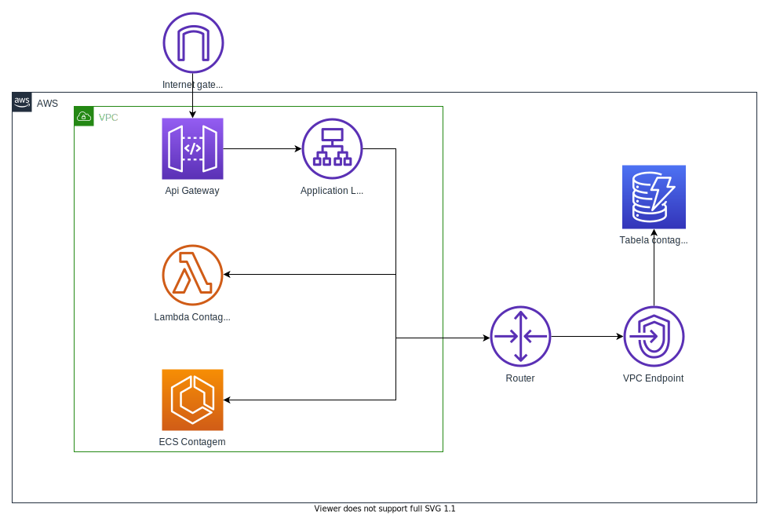

# Estudo - AWS

Estudo prático sobre tecnologias da AWS. 

Contexto:

A empresa X possui uma aplicação legada que contabiliza o número de acessos de cada usuário e deseja modernizar o funcionamento atual de sua solução.
A sugestão proposta foi uma migração parcial com um load balancer delegando 50% das requisições para o legado e 50% para a nova implementaçao.
Em uma situação real o peso da nova solução seria aumentado gradativamente até que eventualmente o legado não receberia mais requisições.

## Arquitetura do projeto

## Tecnologias utilizadas para implementação

- Terraform:
    - Provisionamento da infraestrutura da AWS (IaC)
- API Gateway:
    - Controle das requisições
- Load balancer:
    - Delega requisições entre o legado e a nova solução
- ECS
    - Legado escrito ASP
- Lambda
    - Nova solução escrita em NodeJs
- DynamoDB
    - Armazena os acessos por usuário
- Github Actions
    - Pipeline para provisionamento automático da infraestrutura quando alterações são enviadas ao repositório